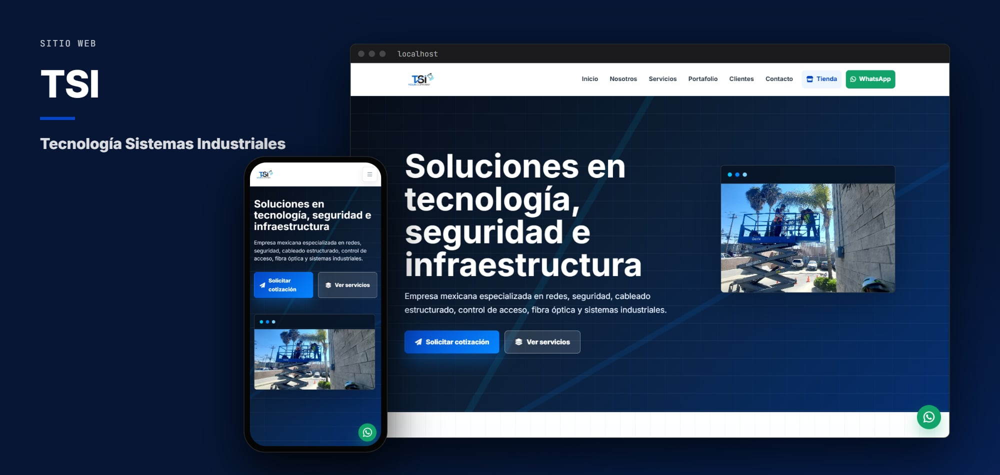
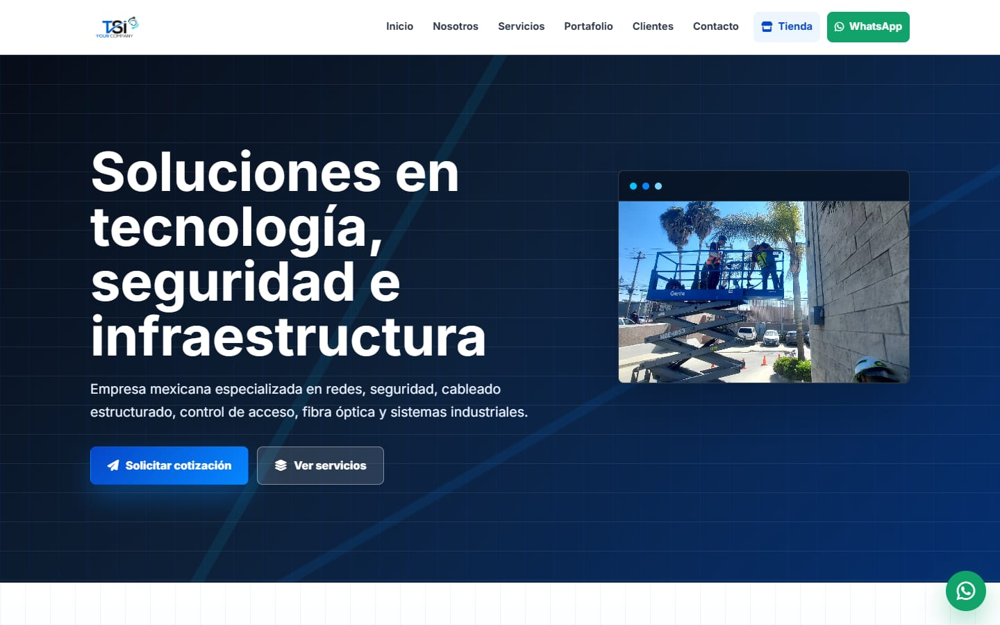
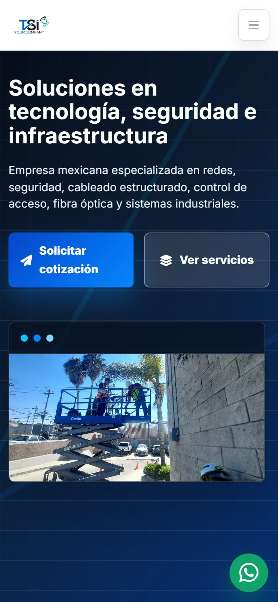

<p align="center">
  
</p>

<h1 align="center">TSI</h1>

<p align="center"><b>Tecnología Sistemas Industriales</b></p>

<p align="center">
  
  
  
  
</p>

## Sobre el proyecto

Sitio de **TSI — Tecnología Sistemas Industriales**, empresa de Tijuana: seguridad, redes, cableado estructurado, fibra óptica e infraestructura industrial.

Es un sitio estático: HTML, CSS y JavaScript sin frameworks ni proceso de build.

## Secciones

| Sección | Contenido |
| --- | --- |
| **Nosotros** | Quiénes somos |
| **Servicios** | Infraestructura, redes y seguridad |
| **Portafolio** | Proyectos realizados |
| **Clientes** | Empresas atendidas |
| **Contacto** | Formulario y WhatsApp |

## Capturas

<p align="center">
  
  &nbsp;
  
</p>

## Tecnologías

- HTML5, CSS3 y JavaScript, sin frameworks ni proceso de build.
- Íconos de [Font Awesome](https://fontawesome.com/) (desde CDN).
- Tipografía de Google Fonts (Inter).
- Diseño adaptable a celular, tableta y computadora.

## Estructura

```
TSISeguridad/
├── AcercaDeNosotros.jpg
├── android-chrome-512x512.png
├── CableadoEstructurado1.jpeg
├── CableadoEstructurado2.jpeg
├── CableadoEstructurado3.jpeg
├── CableadoEstructurado4.jpeg
├── CableadoEstructurado5.jpeg
├── Clientes1.png
├── Clientes2.png
├── Clientes3.png
├── Clientes4.png
├── Clientes5.png
├── docs/                       # Imágenes de este README
├── favicon.ico
├── FirmaQuienesSomos.jpg
├── index.html                  # Página principal
├── Logo.png
├── Portafolio1.jpg
├── Portafolio2.jpg
├── Portafolio3.jpg
├── Portafolio4.jpeg
├── Portafolio5.jpg
├── script.js                   # Interacciones (menú, animaciones)
└── styles.css                  # Estilos
```

## Correr en local

No necesita instalar nada. Abre `index.html` en el navegador, o sírvelo desde la carpeta del repo:

```bash
python -m http.server 8000
```

y entra a <http://localhost:8000>.

## Créditos

Desarrollado por [@Salereee](https://github.com/Salereee). Logotipos, fotografías y textos del negocio pertenecen a TSI.
